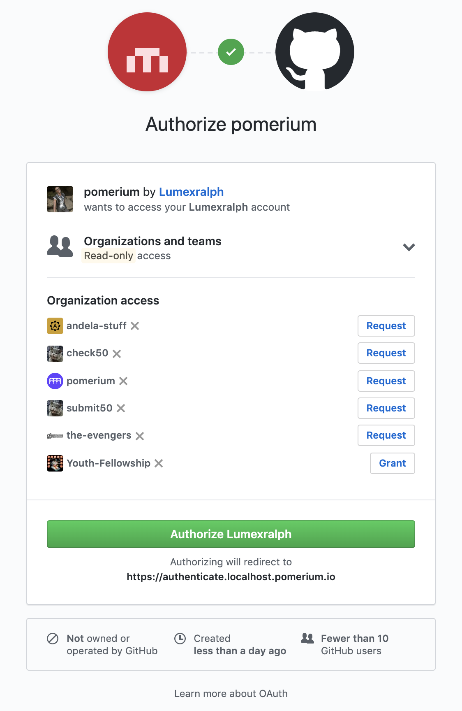

# GitHub

## Setting up GitHub OAuth2 for your Application

We would like you to be aware that GitHub did not implement the OpenID Connect just OAuth2 and for this reason, we have not gotten a better way to implement revocation of user access on sign out yet.

Also, the organizations a user belongs to will be used as the groups on Pomerium dashboard.

Log in to [Github](https://github.com/login) or create an account.

Navigate to your profile using the avatar on the navigation bar and go to your settings. 


Click the Developers settings and create a new OAuth Application


Create a new OAuth2 application by filling the field with the following parameters:

Field                       | Description
--------------------------- | --------------------------------------------
Application name            | The name of your web app
Homepage URL                | The homepage URL of the application to be integrated with Pomerium
Authorization callback URL  | `https://${authenticate_service_url}/oauth2/callback`, authenticate_service_url from pomerium configuration


After the application had been created, you will have access to the credentials, the **Client ID** and **Client Secret**.

## Pomerium Configuration

If the setup for GitHub OAuth application has been completed, you can create your **Pomerium** configuration like the example below:

```bash
authenticate_service_url: https://authenticate.localhost.pomerium.io
idp_provider: "github"
idp_client_id: "REDACTED"   // github application ID
idp_client_secret: "REDACTED"   // github application secret
```

Whenever a user tries to access  your application integrated with Pomerium, they will be presented with a sign-on page as below:


