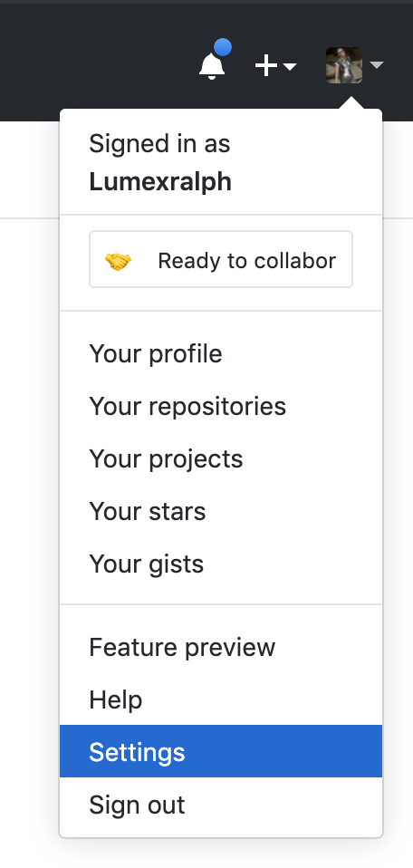

# GitHub

This document describes the use of GitHub as an identity provider for Pomerium.

Before we proceed, please be aware that [GitHub API] does not support [OpenID Connect], just [OAuth 2.0].
For this reason, it was challenging to implement revocation of a user's **Access Token** (a string representing the granted permissions) when they sign out from Pomerium's dashboard. 

In addition, the teams of the organization(s) a user belongs to, will be used as groups on Pomerium.

## Setting up GitHub OAuth 2.0 for your Application

1. Log in to [Github](https://github.com/login) or create an account.

2. Navigate to your profile using the avatar on the navigation bar.

3. Go to your settings. 



4. Click the Developers settings and create a new OAuth Application.


5. Create a new OAuth2 application by filling the form fields above with the following parameters:

Field                       | Description
--------------------------- | --------------------------------------------
Application name            | The name of your web app
Homepage URL                | The homepage URL of the application to be integrated with Pomerium
Authorization callback URL  | `https://${authenticate_service_url}/oauth2/callback`, authenticate_service_url from pomerium configuration


After the application had been created, you will have access to the credentials, the **Client ID** and **Client Secret**.


## Pomerium Configuration

After creating your GitHub OAuth application, you can create your **Pomerium** configuration like the example below:

```bash
authenticate_service_url: https://authenticate.localhost.pomerium.io
idp_provider: "github"
idp_client_id: "REDACTED"   // github application ID
idp_client_secret: "REDACTED"   // github application secret
```

Whenever a user tries to access  your application integrated with Pomerium, they will be presented with a sign-on page as below:


[Github API]: https://developer.github.com/v3/#oauth2-token-sent-in-a-header
[openid connect]: https://en.wikipedia.org/wiki/OpenID_Connect
[OAuth 2.0]: https://auth0.com/docs/protocols/oauth2
