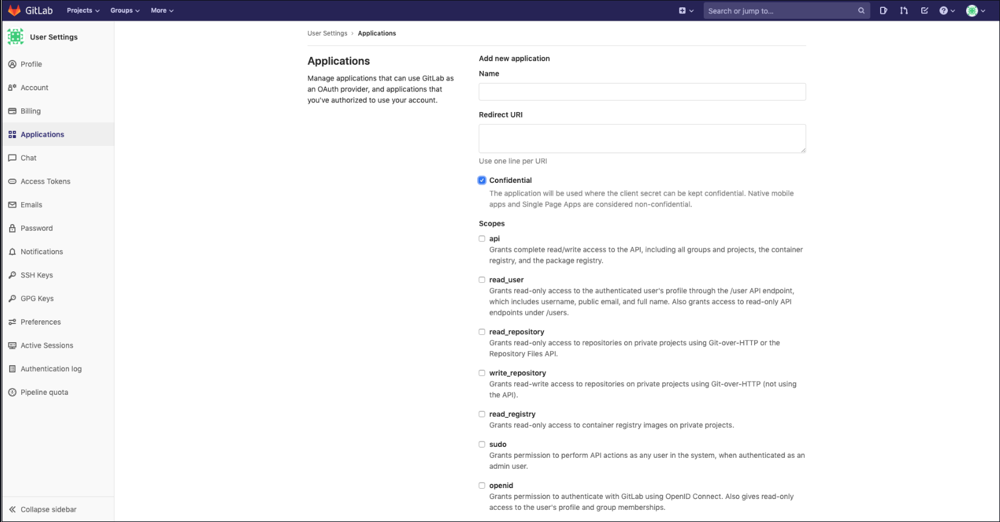
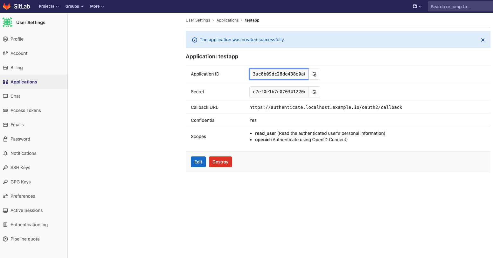

# GitLab

Log in to your GitLab account or create one [here](https://gitlab.com/users/sign_in)

Go to the user settings which can be found in the user profile to [create an application](https://gitlab.com/profile/applications) where you will get your app credentials



On the **Applications** page, add a new application by setting the following parameters:

Field        | Description
------------ | --------------------------------------------
Name         | The name of your web app
Redirect URI | `https://${authenticate_service_url}/oauth2/callback`
Scopes       | **Must** select **read_user** and **openid**

Your `Client ID` and `Client Secret` will be displayed:



Set `Client ID` and `Client Secret` in Pomerium's settings. Your [environmental variables] should look something like this.

```bash
authenticate_service_url: https://authenticate.localhost.pomerium.io
idp_provider: "gitlab"
idp_client_id: "REDACTED"   // gitlab application ID
idp_client_secret: "REDACTED"   // gitlab application secret
```

When a user first uses pomerium to login, they will be presented with an authorization screen similar to the following depending on the scope parameters setup.

